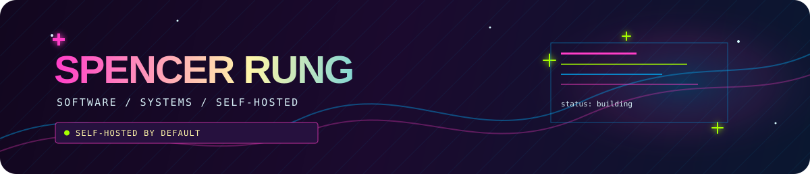
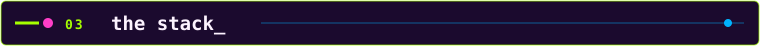

  

  <a href="https://alucard.dev">alucard.dev</a> &nbsp;✦&nbsp; self-hosted by default

I'm Spencer a developer and self-hosting enthusiast making useful and less useful thing to pollute my homelab with.

Right now I'm also figuring out how agents and "agentic" solutions can become capable infrastructure components instead of another disposable demo. 

I'm also deep in the **Kubernetes + CNCF** ecosystem, running real services for myself and friends from some Raspberry Pi's in my basement.

| signal | what that means |
| :-- | :-- |
| `agentic experiments` | building and learning alongside agents that remember, adapt, and do real work |
| `homelab` | GitOps on a 9-node Raspberry Pi k3s cluster with Flux, Vault, monitoring, and a growing constellation of services |
| `software for humans` | tools for therapists working on their licensure and continuing education |
| `rust + wasm` | making vivid browser experiences with framework-free TypeScript and Rust-powered physics |

  

  
  
  
  
  

  
  
  
  
  
  
  
  

- **[Aimtrix](https://github.com/spencerrung/aimtrix)** — a self-hostable Matrix client built around real interoperability, privacy-conscious UX, and the chat features people actually expect.
- **[breathe](https://breathe.alucard.dev)** — a private, beautiful paced-breathing guide for therapist-client work, built with a glowing Rust/WASM particle system.
- **[therapyhours.net](https://therapyhours.net)** — an app for therapists tracking the supervised hours that lead to licensure.
- **homelab-k8s** — the GitOps repo for my homelab.
- **[alucard.dev](https://alucard.dev)** — my little corner of the web: projects, experiments, and the general transmission.

The best place to find me is...

